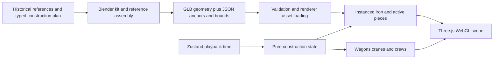

# Eiffel Tower: Blender MCP to deterministic web construction

Research completed 2026-09-06. This is an implementation proposal with live connectivity evidence, not a new tower model or visual acceptance. Production source, specs, model assets, and global MCP configuration were not changed.

Scope clarification: the owner's voice transcription meant **best practices** for Blender-to-web construction animation. This report covers that workflow. The owner also authorized suitable in-session sub-agents in place of earlier model-specific delegation instructions.

**Recommendation:** use the existing Blender Lab MCP to author a small, reusable ironwork kit and a complete reference assembly for inspection. Export geometry and construction anchors, then let WonderForge's existing TypeScript engine place and animate those pieces. Start with one representative lower-leg assembly in an isolated preview. A full baked tower movie would duplicate the construction engine and make physical corrections harder.

**What is already here**

The application is React 19, TypeScript, Vite, Zustand, and imperative Three.js/WebGL. React owns the canvas and controls; the playback store owns normalized time; pure engine/data modules own construction state; renderer modules own GPU objects. No renderer migration, React Three Fiber, GSAP, backend, or runtime Blender service is required. See [architecture](/Users/hina/Documents/Experience-Intelligence-Domain/wonderforge/specs/03-architecture.md).

Eiffel has a dedicated typed plan, engine, camera, terrain, sky, iron renderer, and worker/mechanism renderer. [EiffelWorld](/Users/hina/Documents/Experience-Intelligence-Domain/wonderforge/src/render/three/EiffelWorld.ts:19) composes them. Its iron update returns active operations that drive the work system, so the carried part and crane already share event state.

The current construction graph is `yard → hauled → staged → hoisted → seated`. [EiffelPart](/Users/hina/Documents/Experience-Intelligence-Domain/wonderforge/src/data/eiffelTypes.ts:29) carries identity, kind, leg/storey, final transform, dimensions, route, and timing. The plan declares 312 m height, platforms at 57/115/276 m, 96 active operations, and an intentionally exaggerated 197 m base. The base is a diorama decision, not a measured historical dimension. [Plan constants](/Users/hina/Documents/Experience-Intelligence-Domain/wonderforge/src/data/eiffelConstruction.ts:14), [Spec 14](/Users/hina/Documents/Experience-Intelligence-Domain/wonderforge/specs/14-eiffel-tower-reference-scene.md).

The latest handoff is pass 149: Eiffel audio is finished, with Adam narration and its own reviewed score. Visuals remain pass 148, with unresolved opening/join leg overlap and iron readability. The handoff explicitly says camera experiments are exhausted. These are recorded findings, not fresh visual judgements from this research. [Handoff](/Users/hina/Documents/Experience-Intelligence-Domain/wonderforge/HANDOFF.md:3).

Blender is already used for the 1878 Palais du Trocadéro. [Its authoring script](/Users/hina/Documents/Experience-Intelligence-Domain/wonderforge/scripts/blender_eiffel_trocadero.py) exports a local GLB; [the loader](/Users/hina/Documents/Experience-Intelligence-Domain/wonderforge/src/render/three/eiffelPalais.ts:81) parses it and assigns runtime materials; [the environment](/Users/hina/Documents/Experience-Intelligence-Domain/wonderforge/src/render/three/EiffelEnvironment.ts:217) falls back to procedural architecture if loading fails. Inspection of the actual GLB found 191,728 bytes, 82 nodes, 79 meshes, 2,158 triangles, four materials, no textures, and no animation. That proves an asset pipeline exists, not that the tower itself has been modeled in Blender.

**Blender MCP: verified, without installation**

I initialized the already installed Blender Lab MCP server over stdio, enumerated 26 tools, and called `execute_blender_code` with read-only scene inspection. The response reported Blender 5.2.1 LTS, enabled add-on `bl_ext.lab_blender_org.mcp`, and the default Camera/Cube/Light scene. The scene had no saved filepath and was not dirty. Evidence is in [blender-mcp-probe.json](/Users/hina/Documents/Experience-Intelligence-Domain/wonderforge/artifacts/eiffel-blender-research-2026-09-06/blender-mcp-probe.json); [the repeatable probe](/Users/hina/Documents/Experience-Intelligence-Domain/wonderforge/artifacts/eiffel-blender-research-2026-09-06/probe_blender_mcp.py) contains the exact client call.

This was a real MCP tool invocation through the installed server, not merely a successful TCP connection. The installed package's Python interpreter starts `-m blmcp`; its add-on connection is local port 9876. The package lives in Claude's installed extensions, but an independent MCP client successfully used it.

No Blender tool was exposed directly in this Codex turn's native tool list. The existing Codex configuration instead names `uvx blender-mcp`, matching the separate ahujasid community project's setup. I did not verify that configured server against the live Lab add-on or change global configuration. Reusing the verified Lab server is the next configuration choice if native Codex tools are desired. [Blender Lab MCP](https://www.blender.org/lab/mcp-server/), [community MCP setup](https://github.com/ahujasid/blender-mcp).

No new plugin or skill is needed for this workflow. Existing authoring and Three.js code plus the working Lab bridge cover it. A custom repeatable author/export/validate skill could be useful after the first accepted asset; it is not a dependency. Paid text-to-3D services are unnecessary for an original, dimensioned iron kit.

**Options for continuing Eiffel**

| Approach | What improves | Tradeoff | Recommendation |
|---|---|---|---|
| Reusable member geometry: chords, braces, gussets, deck sections | Cross-sections, joints, material response; preserves existing part IDs and events | Does not fix the overall pylon arrangement by itself | First technical experiment |
| Complete authored pylon bay, exported as separate members and anchors | Taper, member spacing, negative space, and joint composition can be inspected together | Requires an explicit asset/plan boundary and new contact checks | Next visual experiment |
| Entire GLB with a baked 60-second construction clip | Fast fixed playback once authored | Two sources of timing, difficult transport/crew coupling, limited construction edits | Do not use for structural assembly |

For the first experiment, author one chord, diagonal, joint plate, and their assembled lower-leg context. Keep the original assembly in a separate Blender scene or background process and save a dedicated `.blend` plus the generating Python script. The existing Palais script calls a global scene wipe; it must not be reused as a generic modeling entry point.

Use reference geometry at documented historical proportions for inspection, and a separately named diorama variant for the current movie. Do not silently export a historically proportioned tower into a 197 m plan. The official history documents prefabricated parts, riveted assembly, timber falsework, hydraulic alignment, and steam cranes climbing the tower. That supports a modular kit and visible construction process. It also means the current abbreviated falsework is an authored interpretation, not a reconstruction of every documented scaffold. [Eiffel Tower construction history](https://www.toureiffel.paris/en/the-monument/history).

**The authoring-to-runtime contract**

Use Blender for editable meshes, bevels, cross-sections, reusable linked geometry, joint placement, and low-detail variants. Apply modifiers for export. Keep materials to a small number of glTF-compatible PBR roles; preserve WonderForge's runtime iron recipe where it is intentional. Blender shader graphs, constraints, and Geometry Nodes should not be assumed to execute in the browser. Export evaluated geometry or supported baked animation as appropriate. Blender supports custom properties through glTF `extras`. [Blender glTF manual](https://docs.blender.org/manual/en/5.1/addons/import_export/scene_gltf2.html).

For each kit asset, provide a stable mesh key, schema version, unit convention, local bounds, local lifting anchor, contact points, material role, and LOD key. Keep installation order and timing in the TypeScript plan. Proposed outputs are a versioned `iron-kit.glb` and `iron-kit.manifest.json`; these files have not been generated in this research.

Prefer origin-centered, Y-up geometry in final metres, with identity scale, or explicitly declare normalized geometry with fixed dimensional scaling. Never mix the two. The existing Palais script maps world `(x,y,z)` into Blender `(x,-z,y)` and enables Y-up export. Validate a known asymmetric test object through export/import before applying that convention to every member. Bake parent transforms into mesh-local geometry once; do not apply the conversion again in Three.js.

At load time, resolve mesh keys, validate finite dimensions and anchors, extract geometry, and create shared instanced batches by geometry/material/LOD. Do not clone the whole imported scene for every member. Three.js demonstrates extracting GLB geometry for instancing; ownership and disposal remain application responsibilities. [Three.js instancing example](https://github.com/mrdoob/three.js/blob/dev/examples/webgl_instancing_scatter.html), [disposal documentation](https://threejs.org/manual/en/how-to-dispose-of-objects.html).

Keep structural animation in `eiffelPartStateAt(part, route, t)`. Its output transforms the same geometry through every phase. Blender animation can later supply worker cycles or local mechanism motion, sampled from absolute playback time. It should not create a second wall clock. Reversed scrubbing, a fresh seek, replay, and reduced-motion stills must agree at the same `t`.

**Specific integration risks found in this code**

1. **Shape changes at seating.** Settled climbing chords/braces use special geometry variants, while active pools are keyed only by kind. An imported kit must key both by the same geometry identity so a carried part cannot change cross-section when seated. [Settled variants](/Users/hina/Documents/Experience-Intelligence-Domain/wonderforge/src/render/three/EiffelStoneSystem.ts:263), [active pool](/Users/hina/Documents/Experience-Intelligence-Domain/wonderforge/src/render/three/EiffelStoneSystem.ts:294).

2. **Contact checks currently assume half-height.** `eiffelVerticalHalfExtent` returns `dimensions[1]/2`; the haul test uses that same helper. This does not independently validate a rotated or offset imported mesh. Export contact samples or hull vertices and transform them by the actual model matrix. Measure the lowest contact geometry against terrain/wagon/deck; validate the lifting anchor against the hook. [Engine](/Users/hina/Documents/Experience-Intelligence-Domain/wonderforge/src/engine/eiffelConstruction.ts:45), [test](/Users/hina/Documents/Experience-Intelligence-Domain/wonderforge/tests/eiffel-construction.test.ts:110). This is a limitation of current coverage, not a claim that every existing part is floating.

3. **Loading must participate in readiness, repaint, and disposal.** `EiffelWorld.ready` currently waits only for the environment, and neither `WorldScene` nor `ThreeCanvas` consumes it. A model finishing after a paused frame therefore has no completion-triggered repaint. `mountPalais` also has no disposal check after its asynchronous load. An iron asset must join a readiness contract that actually triggers rendering at the current playback time and disposes late results after a world switch. Deduplicate shared geometry disposal and explicitly release replaced import materials. These are code-path findings, not browser-reproduced failures or measured GPU leaks. [Readiness](/Users/hina/Documents/Experience-Intelligence-Domain/wonderforge/src/render/three/EiffelWorld.ts:27), [frame scheduling](/Users/hina/Documents/Experience-Intelligence-Domain/wonderforge/src/render/three/ThreeCanvas.tsx:52), [async attachment](/Users/hina/Documents/Experience-Intelligence-Domain/wonderforge/src/render/three/EiffelEnvironment.ts:227), [Palais material replacement](/Users/hina/Documents/Experience-Intelligence-Domain/wonderforge/src/render/three/eiffelPalais.ts:22).

4. **There is no mobile triangle headroom.** Existing pass-148 data show about 645k triangles during BUILD and 701k at reveal on mobile, versus the capture tool's 300k limit. Desktop passes the tool's looser 750k limit but exceeds Spec 03's 450k/90-call target. Instancing lowers calls; it does not eliminate rendered triangles. Simplify profiles and tiny rivet detail by screen size while retaining all construction events.

| Existing capture | Desktop calls / triangles | Mobile calls / triangles |
|---|---:|---:|
| Opening 0.12 | 196 / 302,750 | 101 / 300,543 |
| Join 0.32 | 112 / 425,804 | 92 / 425,707 |
| BUILD 0.58 | 123 / 645,324 | 97 / 645,155 |
| Reveal 0.92 | 105 / 700,896 | 98 / 700,955 |

These are saved captures, not new performance measurements. Opening desktop has 114 geometries, while most other samples have 34–37. Because the Palais GLB contains 79 meshes, asset readiness/source consistency should be checked before treating this sweep as a uniform GLB baseline. The count difference alone does not establish why the samples differ. Full values: [asset-and-capture-audit.json](/Users/hina/Documents/Experience-Intelligence-Domain/wonderforge/artifacts/eiffel-blender-research-2026-09-06/asset-and-capture-audit.json).

**Concrete next pass and acceptance**

First amend Spec 14 with the chosen asset boundary and whether the experiment preserves current part envelopes. Build an isolated lower-leg kit preview with identical geometry on both sides of seating. Validate export axes, units, transforms, anchors, and bounds with tests before using it in production. Then run the full required test/typecheck/build sequence and desktop/mobile captures at 0.12, 0.32, 0.58, 0.78, 0.92, and 1.0.

The next visual decision is whether a composed bay improves negative space and pylon identity enough to warrant changing the typed geometry plan. Better bevels alone cannot resolve overlapping whole pylons. Use a capable visual-review sub-agent for that comparison, with Giza as the reference and both historical/diorama variants clearly labeled. The owner clarified that this session may use its own suitable sub-agents; prior model-specific review requirements do not apply.

Verification in this research: live MCP initialization/list/call succeeded; actual GLB contents inspected; 16 tests passed across the Eiffel construction/world suites. No new model, export round trip, fresh web QA, full build, or visual approval is claimed. The subsequent in-session asset/construction sub-agent completed a read-only code review, confirmed the geometry/contact/instancing findings, and strengthened the readiness finding above. Its [review](/Users/hina/Documents/Experience-Intelligence-Domain/wonderforge/artifacts/eiffel-blender-research-2026-09-06/sub-agent-review.md) adds no new test or visual-validation claims.
